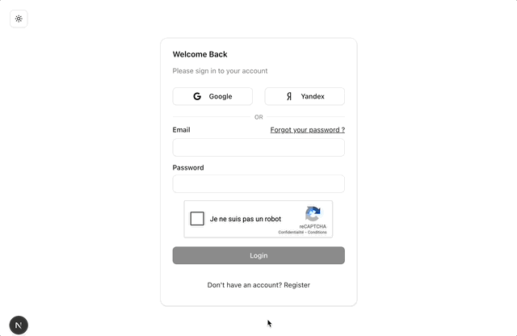
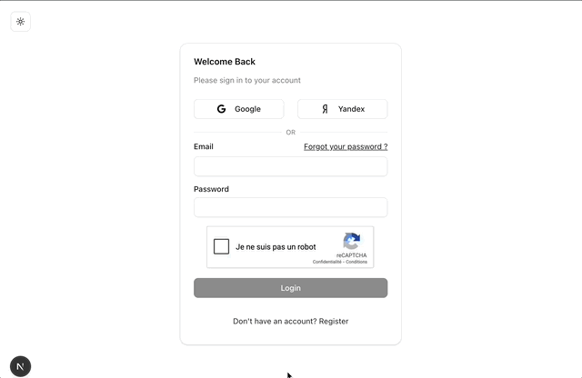
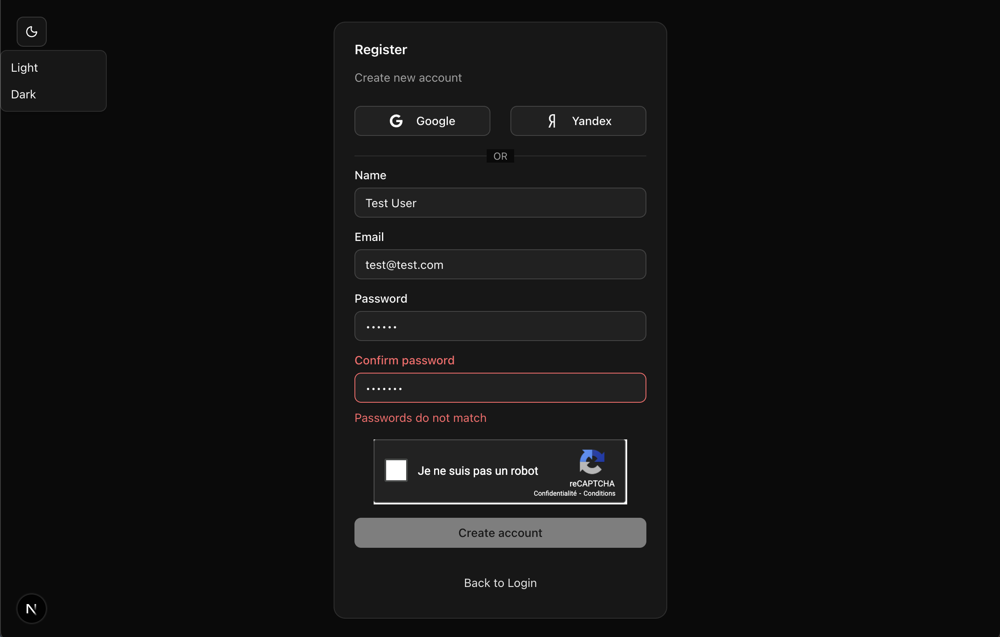

# 🔐 Fullstack Authentication App

[]()


Production ready authentication system with optional 2FA, session management, and modern frontend architecture.

📦 Monorepo (Next.js + NestJS)

🌍 Live Demo: (coming soon)

## 🧩 Features

- Authentication (email/password)
- Optional Two-Factor Authentication (2FA)
- Session-based authentication (Redis)
- OAuth (Google, Yandex)
- Email notifications (Mailpit for dev + react-email)
  - Email confirmation account validation
  - Two factor authentication code
  - Reset password
- Google ReCAPTCHA integration
- Form validation with Zod + React Hook Form
- Modern UI with Tailwind & shadcn/ui
- Data fetching with React Query

## 👁️ Features Preview

### Login Two Factor


### Login Google Session


### Error


### Register Form Dark Mode


## ⚙️ Tech Stack

### Backend
- NestJS
- TypeScript
- Prisma ORM
- PostgreSQL
- Redis (sessions)
- Argon2 (password hashing)

### Frontend
- Next.js 16
- React 19
- TypeScript
- TailwindCSS
- shadcn/ui
- React Query
- React Hook Form + Zod

### Devops
- Docker (Postgres, Redis, Mailpit)

## 💡 Technical highlights

### Architecture
- Nest modular architecture for backend
- Feature oriented architecture for the frontend

### Authentication Flow
- Session-based authentication
- Secure password hashing with Argon2
- Optional 2FA with conditional UI and backend validation

### Form Handling
- Strong validation with Zod
- Advanced form handling with React Hook Forms

### Security
- Google ReCAPTHA integration
- HTTP-only cookies
- Server side session
- Input validation on the frontend and on the backend side

### Nest used concepts:
- Guards
- Custom decorators
- Validation pipe
- Serialization
- Configuration module

### React design patterns
- Custom hooks
- Controlled forms
- Conditional rendering
- Composition
- Container / Presenter
- Server state management
- Routing / Guard

## 🚀 Getting Started

### Prerequisites

- Node.js
- Docker

### Installation

```bash
# backend
cd backend
# start infra
docker-compose up -d
# install dependencies and run project
npm install
npm run start:dev

# frontend
cd frontend
npm install
npm run dev
```

## 🧠 What I Learned

- Designing scalable authentication flows
- Handling optional 2FA in frontend & backend
- Handling OAuth with multiple providers
- Structuring a monorepo fullstack app
- Managing sessions with Redis

## 🔮 Improvements

- Add refresh token flow
- Improve test coverage
- Add rate limiting
- Add role based access control
